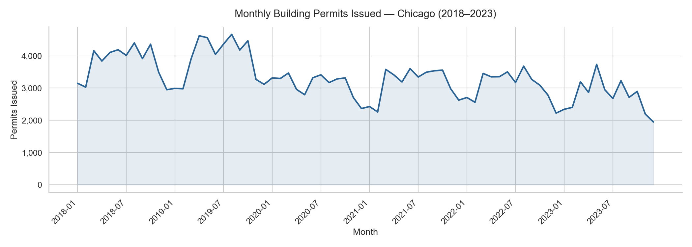
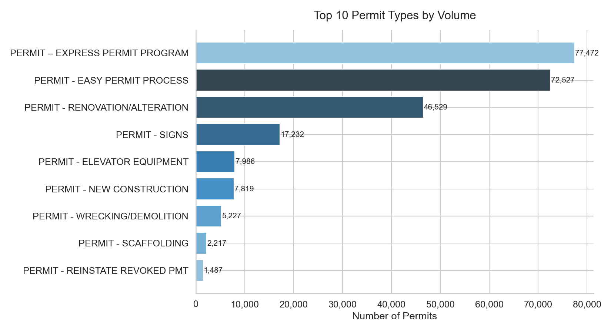
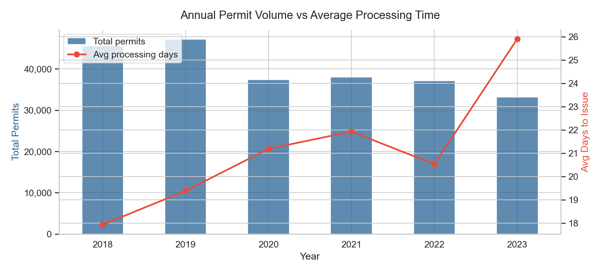
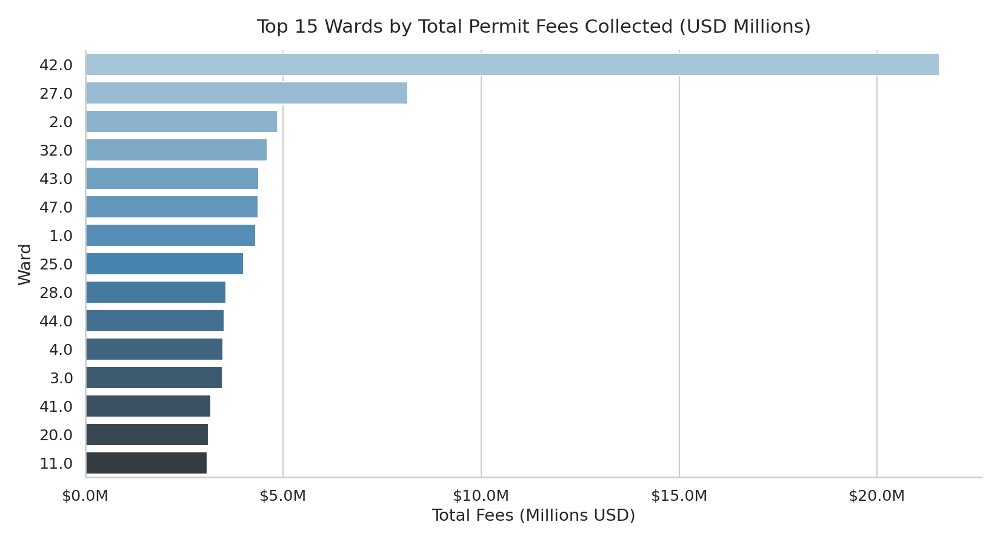
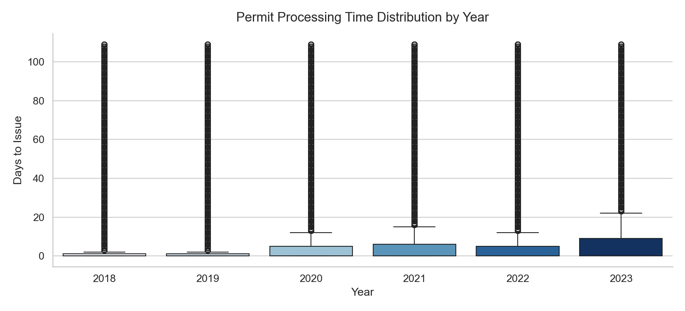
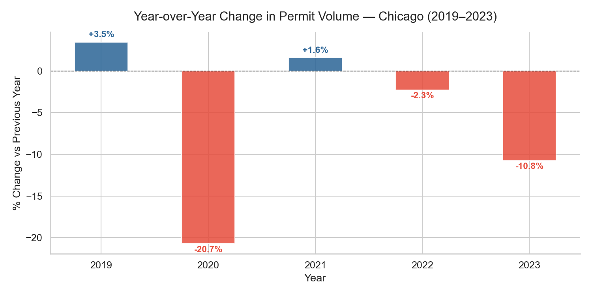
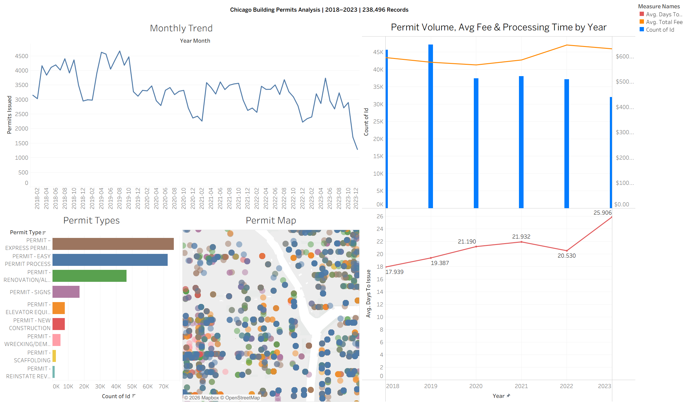
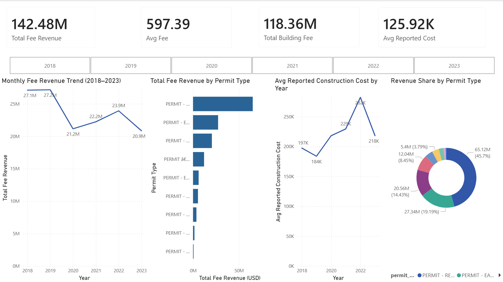
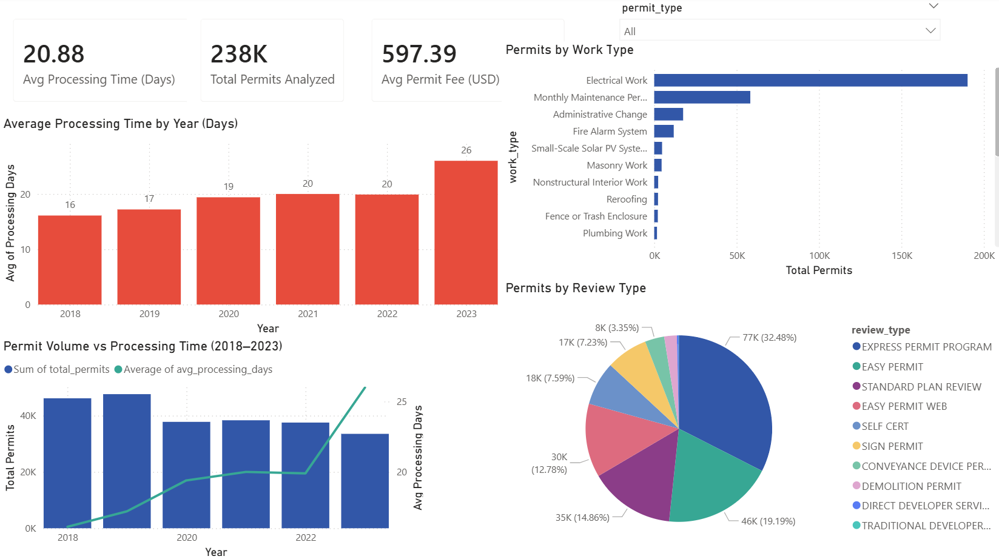
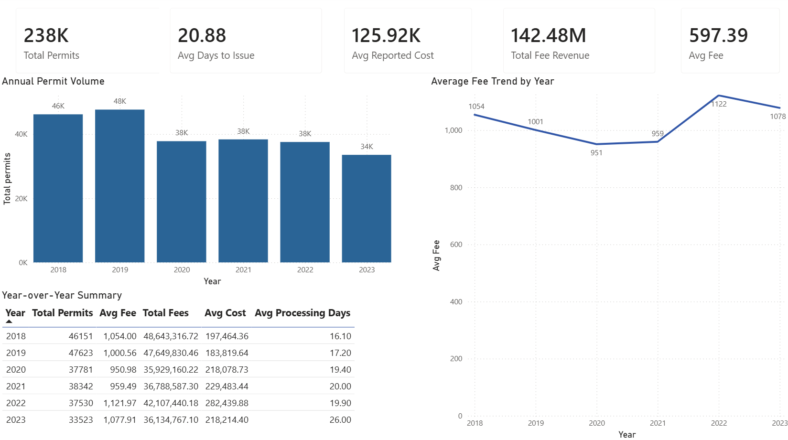

# Urban Development Analytics Pipeline

End-to-end data analytics pipeline analyzing **833,978 building permit records** from the City of Chicago Open Data Portal (2018–2023), built as a freelance data analytics engagement.

[](https://github.com/emaadkalantarii/urban-analytics-pipeline/actions/workflows/ci.yml)
[](https://python.org)
[](https://sqlite.org)
[](https://docker.com)
[](https://public.tableau.com/app/profile/emad.kalantari/viz/ChicagoUrbanDevelopmentAnalytics/ChicagoUrbanDevelopmentAnalytics20182023)
[](urban_analytics_dashboard.pbix)

---

## Table of Contents

- [Live Dashboard](#live-dashboard)
- [Project Overview](#project-overview)
- [Key Findings](#key-findings)
- [Architecture](#architecture)
- [Tech Stack](#tech-stack)
- [Pipeline Walkthrough](#pipeline-walkthrough)
- [Data Quality](#data-quality)
- [Python Visualizations](#python-visualizations)
- [Tableau Public Dashboard](#tableau-public-dashboard)
- [Power BI Dashboard](#power-bi-dashboard)
- [CI/CD](#cicd)
- [Project Structure](#project-structure)
- [How to Run](#how-to-run)
- [Dataset](#dataset)
- [Pipeline Outputs](#pipeline-outputs)
- [Skills Demonstrated](#skills-demonstrated)
- [Future Improvements](#future-improvements)
- [Author](#author)

---

## Live Dashboard

**[View Interactive Tableau Dashboard →](https://public.tableau.com/app/profile/emad.kalantari/viz/ChicagoUrbanDevelopmentAnalytics/ChicagoUrbanDevelopmentAnalytics20182023)**

**[Download Power BI Dashboard (.pbix) →](urban_analytics_dashboard.pbix)**
> Open in Power BI Desktop to explore the full 3-page interactive dashboard with all data connections and measures intact.

---

## Project Overview

A multi-stage data analytics pipeline that ingests, cleans, transforms, and visualizes 833,978 Chicago municipal building permit records. The pipeline covers the full data lifecycle — SQL-based ingestion and cleaning, automated Python ETL with feature engineering, static visualization generation, interactive BI dashboard delivery across two platforms (Tableau Public and Power BI), Docker containerization for reproducible execution, and a GitHub Actions CI/CD pipeline for automated validation.

The pipeline is fully automated: a single Docker command runs all stages end-to-end and writes all outputs to your local machine.

---

## Key Findings

| Metric | Value |
|---|---|
| Total permits analyzed | 238,496 (2018–2023 filtered) |
| Permit volume drop in 2020 | −20.7% (COVID impact) |
| Processing time increase 2018→2023 | 17.9 days → 25.9 days (+44%) |
| Peak fee revenue year | 2019 at $27.2M total |
| Average reported construction cost 2022 | $194,549 (vs $95,302 in 2018) |
| Most common permit type | EXPRESS PERMIT PROGRAM (~80K permits) |
| Express Permit revenue share | 45.7% of total fee revenue |
| Top work type by volume | Electrical Work |

---

## Architecture

```
Raw CSV (833,978 rows)
        │
        ▼
load_to_db.py
  - Strips $ symbols, parses fee columns across 16 fields
  - Loads into SQLite (permits_raw table)
  - Filters nulls → permits_clean table (819,820 rows)
        │
        ▼
sql_analysis.py
  - 8 SQL aggregation queries (GROUP BY, COUNT, AVG, SUM, CAST, SUBSTR)
  - Exports: permits_by_type, monthly_trend,
    yearly_summary, permits_by_ward_year,
    top_zip_by_fees, permits_by_status,
    permits_by_work_type, permits_by_review_type
        │
        ▼
pipeline.py
  - Python ETL: date parsing, feature engineering, outlier removal
  - Filters to 2018–2023, removes top 1% fee outliers
  - Produces 6 Matplotlib/Seaborn visualizations (PNG)
  - Exports pipeline_summary.csv
        │
        ▼
export_dashboard_data.py
  - Builds permits_final.csv (dashboard-ready, 238,496 rows)
  - Adds derived columns: year, month, quarter,
    year_month, days_to_issue
        │
        ▼
Tableau Public                      Power BI Desktop
  - 4-view interactive dashboard      - 3-page analytical dashboard
  - Monthly trend · permit types      - Financial analysis
  - Geo dot map · yearly KPIs         - Operational efficiency
  - Live public URL                   - Executive summary
                                      - .pbix file in repo root
        │
        ▼
GitHub Actions CI/CD
  - Triggered on every push to main
  - Generates synthetic test dataset (500 rows)
  - Runs full pipeline end-to-end
  - Verifies all 10 CSVs and 6 PNGs are produced
```

---

## Tech Stack

| Layer | Tool | Purpose |
|---|---|---|
| Data ingestion | Python (Pandas) | Read, parse, clean raw CSV |
| Database | SQLite via SQLAlchemy | Store raw and clean tables |
| Data transformation | SQL | Aggregations, filtering, feature creation |
| Analysis & automation | Python (Pandas, NumPy) | ETL pipeline, feature engineering |
| Visualization | Matplotlib, Seaborn | Static chart generation (6 PNGs) |
| BI Dashboard | Tableau Public | Interactive geographic and volume dashboard |
| BI Dashboard | Power BI Desktop | Financial and operational analytical dashboard |
| Containerization | Docker, docker-compose | Reproducible single-command execution |
| CI/CD | GitHub Actions | Automated pipeline validation on every push |
| Version control | Git, GitHub | Source control and portfolio hosting |

---

## Pipeline Walkthrough

### Phase 1 — Data Ingestion (`load_to_db.py`)

Reads the raw 833,978-row CSV from the Chicago Open Data Portal. Column names are normalized to lowercase with underscores. The `permit#` column is renamed to `permit_num` to create a valid SQL identifier. All 16 fee columns are cleaned by stripping `$` and `,` characters and converting to float. The `reported_cost` column receives the same treatment. The cleaned DataFrame is loaded into SQLite as `permits_raw`. A `CREATE TABLE AS SELECT` statement then produces `permits_clean` by filtering out rows where `issue_date`, `latitude`, or `longitude` are null, and where `total_fee` is zero or negative — leaving 819,820 quality-filtered rows.

### Phase 2 — SQL Analysis (`sql_analysis.py`)

Runs 8 analytical SQL queries against `permits_clean` using SQLAlchemy. Queries use `GROUP BY`, `COUNT`, `AVG`, `SUM`, `ROUND`, `CAST`, and `SUBSTR` for date field parsing (the date is stored as `MM/DD/YYYY` text, so year extraction uses `SUBSTR(issue_date, 7, 4)`). Results are exported as 8 CSVs covering permit type distribution, ward-year breakdown, community area fee revenue, monthly trends, yearly summary, status distribution, work type breakdown, and review type breakdown.

### Phase 3 — Python ETL & Visualization (`pipeline.py`)

Reads `permits_clean` from SQLite into a Pandas DataFrame. Parses `issue_date` and `application_start_date` to datetime, then engineers `year`, `month`, `year_month` (Period), and `days_to_issue` (date difference in days). Filters to 2018–2023 and removes rows where `total_fee` exceeds the 99th percentile (outlier removal). Removes negative `days_to_issue` values. Produces 6 Matplotlib/Seaborn charts saved as PNG. Exports `pipeline_summary.csv` with yearly aggregates and prints a summary table to terminal.

### Phase 4 — Dashboard Export (`export_dashboard_data.py`)

Reads `permits_clean` and applies the same date parsing and feature engineering as `pipeline.py`. Additionally derives `month_name` (full month string), `quarter` (1–4), and `year_month` (formatted as `YYYY-MM` string for Tableau compatibility). Converts `ward` and `community_area` to numeric. Selects 22 output columns and exports `permits_final.csv` with 238,496 rows — the working dataset for both Tableau and Power BI.

---

## Data Quality

Real data quality decisions made during the pipeline:

| Issue | Decision | Impact |
|---|---|---|
| Fee columns stored as `$1,234.56` strings | Strip `$` and `,`, convert to float | Enabled all fee-based filtering and aggregation |
| `permit#` column name invalid for SQL | Renamed to `permit_num` | Prevented SQL `OperationalError` on table creation |
| 12,798 rows with null latitude/longitude | Filtered out in `permits_clean` | Removed unmappable permits from geographic analysis |
| Rows with `total_fee = 0` | Filtered out in `permits_clean` | Removed test/waived records from fee analysis |
| Fee outliers at extreme high end | Removed top 1% in pipeline | Prevented skew in visualization axes |
| Negative `days_to_issue` values | Filtered out in pipeline | Removed data entry errors (application after issue) |
| Permits outside 2018–2023 | Filtered in pipeline and dashboard export | Focused analysis on a consistent 6-year window |

---

## Python Visualizations

Six static charts generated automatically by `pipeline.py` and saved as high-resolution PNGs to `docs/visualizations/`.

---

### 1 — Monthly Permit Trend (2018–2023)


A time-series line chart showing monthly permit volume across the full 2018–2023 period. The sharp dip in mid-2020 clearly captures the COVID-19 impact on Chicago's construction activity, followed by a partial recovery in 2021 and a gradual sustained decline through 2023. This chart tells the most important macro story in the dataset and anchors all downstream analysis.

---

### 2 — Top 10 Permit Types by Volume


A horizontal bar chart ranking the 10 most common permit types with exact permit counts labeled on each bar. Express Permit and Easy Permit programs dominate at roughly 80K each, revealing that the majority of Chicago's permitting activity is routine and fast-tracked rather than major new construction — an insight directly relevant to how the city allocates its permitting resources.

---

### 3 — Annual Permit Volume vs Average Processing Time


A dual-axis chart combining blue bars (total permit volume per year) with a red line (average days to issue a permit). The counterintuitive finding is immediately visible: as permit volume declines from 2019 onward, processing time consistently increases — fewer permits being handled yet each one taking longer. This is the most analytically significant chart in the pipeline and the clearest signal of an efficiency problem.

---

### 4 — Top 15 Wards by Total Permit Fees Collected


A horizontal bar chart showing the top 15 Chicago wards by total fee revenue, with labels combining ward numbers and neighborhood names (e.g. "Ward 42 — The Loop / River North"). This geographic financial breakdown reveals where construction investment is concentrated across the city, making the data meaningful to stakeholders unfamiliar with Chicago's ward numbering system.

---

### 5 — Permit Processing Time Distribution by Year


A box plot showing the full statistical distribution of days-to-issue for each year, trimmed at the 95th percentile to remove extreme outliers. Beyond the rising median visible in Chart 3, this chart reveals widening variance from 2020 onward — meaning not only are average processing times increasing, but the experience is becoming more unpredictable, with a growing tail of permits taking dramatically longer than the norm.

---

### 6 — Year-over-Year Permit Volume Change


A diverging bar chart showing the percentage change in permit volume compared to the prior year, with positive years in blue and negative years in red, with exact percentages labeled on each bar. The 2020 drop stands out immediately as the single largest year-on-year decline. This chart makes the trend narrative instantly scannable without requiring any axis reading, and is the most presentation-ready view in the pipeline.

---

## Tableau Public Dashboard

Four-view interactive dashboard published at the live URL above. All views are cross-filtered — clicking any permit type in the bar chart updates the trend line and geographic map simultaneously.

### Dashboard Overview


The dashboard combines four complementary views: a monthly trend line (top left) showing the full 2018–2023 volume story with the 2020 dip clearly visible, a permit type bar chart (bottom left) showing the structural breakdown by type, a geographic dot map (bottom center) plotting 238,496 individual permits across Chicago's neighborhoods colored by permit type, and a multi-measure KPI panel (right) showing annual permit count, average fee, and average processing time together on a single combined chart. The cross-filter interactivity allows drilling from city-wide patterns down to individual permit type geographies in one click.

---

## Power BI Dashboard

Three-page analytical dashboard built on the pipeline's processed CSV outputs, designed as a financial and operational complement to the Tableau geographic dashboard. The `.pbix` file is available in the repository root and can be opened directly in Power BI Desktop.

---

### Page 1 — Financial Analysis


Focuses on fee revenue and construction cost trends across the 2018–2023 period. Four KPI cards surface total fee revenue ($142.48M), average permit fee ($597), total building fees ($118.36M), and average reported construction cost ($125.92K). The monthly fee revenue line chart shows the 2020 revenue dip and recovery pattern, the permit type bar chart ranks types by total fees generated, the construction cost line chart reveals a sharp cost spike in 2022, and the donut chart breaks down revenue share — showing that Express Permits alone account for 45.7% of all fee revenue. A year slicer filters all visuals simultaneously.

---

### Page 2 — Operational Efficiency


Focuses on processing time degradation, work type distribution, and permit review pathway analysis. The red column chart shows average processing days rising from 16 (2018) to 26 (2023) — a 44% efficiency decline over six years. The dual-axis chart combines volume and processing time to make the inverse relationship explicit at a glance. The work type bar chart reveals Electrical Work as the dominant category by permit volume, and the review type pie chart shows how permits move through the system — Express Permit Program (32.5%) and Easy Permit (19.2%) together account for over half of all reviews.

---

### Page 3 — Executive Summary


A single-page stakeholder-ready summary designed for decision-makers who need the complete picture without navigating individual analysis pages. Five KPI cards provide the headline numbers, a sortable year-over-year data table gives the complete numerical record from 2018–2023 across all key metrics, an annual permit volume column chart shows the volume trajectory with data labels, and an average fee trend line shows the fee evolution over time.

---

## CI/CD

GitHub Actions workflow runs automatically on every push to `main` and on every pull request.

### CI Pipeline Screenshot


**What the pipeline does (25s total runtime):**
1. Spins up a clean Ubuntu Linux environment on GitHub's servers
2. Installs Python 3.11 and all pipeline dependencies from `requirements.docker.txt`
3. Runs `generate_test_data.py` to produce a 500-row synthetic dataset matching the real data schema exactly — including `$`-formatted fee columns, `MM/DD/YYYY` date strings, and all 95 original columns
4. Runs `load_to_db.py` against the synthetic data
5. Runs `sql_analysis.py`
6. Runs `pipeline.py` with `MPLBACKEND=Agg` to render charts without a display
7. Runs `export_dashboard_data.py`
8. Verifies all expected outputs exist: `urban_analytics.db`, 10 processed CSVs, and 6 PNG visualizations

A green badge on this README confirms the pipeline is passing. If any script fails or any output file is missing, the workflow fails and the badge turns red — ensuring the pipeline is always in a working state.

**Workflow file:** `.github/workflows/ci.yml`
**Test data generator:** `scripts/generate_test_data.py`

---

## Project Structure

```
urban-analytics-pipeline/
├── .github/
│   └── workflows/
│       └── ci.yml                  # GitHub Actions CI/CD workflow
├── scripts/
│   ├── load_to_db.py               # Ingest raw CSV → SQLite database
│   ├── sql_analysis.py             # SQL aggregations → processed CSVs
│   ├── pipeline.py                 # Full ETL + visualization pipeline
│   ├── export_dashboard_data.py    # Export dashboard-ready CSV
│   ├── generate_test_data.py       # Synthetic data generator for CI
│   ├── inspect_columns.py          # Column inspection utility
│   └── diagnose.py                 # Data quality diagnostic utility
├── data/
│   ├── raw/                        # Raw source data (not tracked in Git)
│   └── processed/                  # Cleaned and aggregated CSVs
├── notebooks/
│   └── 01_eda.ipynb                # Exploratory data analysis
├── docs/
│   └── visualizations/             # Pipeline charts, dashboard screenshots, CI badge
├── urban_analytics_dashboard.pbix  # Power BI dashboard — open in Power BI Desktop
├── Dockerfile
├── docker-compose.yml
├── requirements.txt                # Full local environment
└── requirements.docker.txt         # Minimal Docker environment (used in CI and Docker)
```

---

## How to Run

You have two options. **Option A (Docker)** is recommended — it requires no Python setup and runs the entire pipeline automatically with a single command. **Option B (Local)** runs each script manually in your own Python environment.

---

### Prerequisites — Dataset (required for both options)

1. Go to the [Chicago Data Portal — Building Permits](https://data.cityofchicago.org/Buildings/Building-Permits/ydr8-5enu)
2. Click **Export → CSV** and download the file
3. Rename it to `building_permits.csv` and place it at:

```
data/raw/building_permits.csv
```

> This file is excluded from Git (listed in `.gitignore`) because it is ~150 MB. It must be downloaded manually before running either option.

---

### Option A — Docker (recommended, fully automated)

**Requires:** [Docker Desktop](https://www.docker.com/products/docker-desktop/) installed and running.

Docker installs all dependencies inside an isolated container and runs the full pipeline automatically — no Python installation needed on your machine. All output files are written to your local folders via volume mounts.

```bash
git clone https://github.com/emaadkalantarii/urban-analytics-pipeline.git
cd urban-analytics-pipeline
```

Add the dataset to `data/raw/building_permits.csv`, then run:

```bash
docker-compose up
```

**What happens automatically inside the container:**
1. All Python dependencies are installed from `requirements.docker.txt`
2. `pipeline.py` executes the full ETL and visualization pipeline
3. 6 chart PNGs are saved to `docs/visualizations/`
4. 10 processed CSVs are saved to `data/processed/`
5. Container exits cleanly with code 0

When finished:

```bash
docker-compose down
```

> To run the full pipeline including SQL analysis and dashboard export:
> ```bash
> docker-compose run pipeline python scripts/load_to_db.py
> docker-compose run pipeline python scripts/sql_analysis.py
> docker-compose run pipeline python scripts/export_dashboard_data.py
> ```

---

### Option B — Local Python (manual, step-by-step)

**Requires:** Python 3.11+, Git.

```bash
git clone https://github.com/emaadkalantarii/urban-analytics-pipeline.git
cd urban-analytics-pipeline
```

Create and activate a virtual environment:

```bash
# Windows
python -m venv venv
venv\Scripts\activate

# macOS / Linux
python -m venv venv
source venv/bin/activate
```

Install dependencies:

```bash
pip install -r requirements.txt
```

Run each script in order:

```bash
# Step 1 — Load raw CSV into SQLite and create clean table (819,820 rows)
python scripts/load_to_db.py

# Step 2 — Run 8 SQL aggregation queries, export 8 processed CSVs
python scripts/sql_analysis.py

# Step 3 — Run full ETL pipeline, generate 6 visualizations, export summary
python scripts/pipeline.py

# Step 4 — Export dashboard-ready CSV for Tableau and Power BI (238,496 rows)
python scripts/export_dashboard_data.py
```

**Expected outputs after all steps:**
- `data/urban_analytics.db` — SQLite database with raw and clean tables
- `data/processed/` — 10 analysis-ready CSV files
- `docs/visualizations/` — 6 PNG chart files
- Terminal prints a yearly summary table with permit counts, fees, and processing times per year

---

## Dataset

| Field | Detail |
|---|---|
| Source | [City of Chicago — Building Permits](https://data.cityofchicago.org/Buildings/Building-Permits/ydr8-5enu) |
| Total records | 833,978 |
| Records after cleaning | 819,820 |
| Pipeline working range | 2018–2023 |
| Columns in raw dataset | 95 |
| License | Public domain — Chicago Open Data Portal |

---

## Pipeline Outputs

| File | Description |
|---|---|
| `permits_by_type.csv` | Permit counts and fees by permit type |
| `permits_by_ward_year.csv` | Ward-level breakdown by year |
| `monthly_trend.csv` | Monthly permit volume and fee totals |
| `yearly_summary.csv` | Year-over-year KPI summary |
| `top_zip_by_fees.csv` | Top 20 community areas by fee revenue |
| `permits_by_status.csv` | Distribution by permit status |
| `permits_by_work_type.csv` | Distribution by work type |
| `permits_by_review_type.csv` | Distribution by review type |
| `pipeline_summary.csv` | Final aggregated yearly summary |
| `permits_final.csv` | Full dashboard-ready dataset (238,496 rows) |

---

## Skills Demonstrated

**Data Analysis:**
- Exploratory data analysis on a large real-world municipal dataset
- Feature engineering: date parsing, derived time columns, outlier detection
- Statistical analysis: distributions, percentile filtering, year-over-year calculations
- Domain-specific insight extraction for urban planning stakeholders

**Data Engineering:**
- ETL pipeline design and implementation across 4 modular scripts
- SQL database design with raw and clean table separation
- Currency string parsing and type normalization at scale
- Multi-format data export (SQLite, CSV, PNG)

**SQL:**
- `GROUP BY` aggregations across multiple dimensions simultaneously
- Date parsing from text format using `SUBSTR` and `CAST`
- `COUNT`, `AVG`, `SUM`, `ROUND` for analytical aggregations
- `CREATE TABLE AS SELECT` for derived table creation
- `WHERE` filtering for data quality enforcement

**Business Intelligence:**
- Tableau Public: geographic dot maps, cross-filter interactivity, multi-measure KPI panels
- Power BI: DAX measures, multi-page report design, financial and operational dashboards
- Dashboard design principles: KPI cards, slicers, dual-axis charts, donut/pie breakdowns

**Software Engineering:**
- Docker containerization with minimal Linux image and volume mounts
- GitHub Actions CI/CD with synthetic test data generation
- Modular script design with clear single responsibilities
- Python virtual environment and dependency management

---

## Future Improvements

- **AWS integration** — store raw data in S3, run the pipeline on AWS Lambda or ECS, load outputs to Redshift
- **Forecasting model** — add a time-series forecasting layer (Prophet or ARIMA) to predict future permit volume
- **Airflow orchestration** — schedule the pipeline to run automatically on a daily or weekly basis
- **dbt transformation layer** — replace raw SQL queries with dbt models for better versioning and testing
- **Power BI Service publishing** — publish the Power BI dashboard to Power BI Service for a live public URL
- **Extended geographic analysis** — join with Chicago neighborhood shapefiles for choropleth maps
- **Streamlit app** — wrap the pipeline outputs in an interactive web application for non-technical stakeholders

---

## Author

**Emad Kalantari**

Master's in Information and Computer Sciences — University of Luxembourg

[](https://www.linkedin.com/in/emad-kalantari)
[](https://github.com/emaadkalantarii)
[](https://emadkalantari.com)


## License

This project is licensed under the MIT License.

The dataset used in this project is provided by the City of Chicago under the public domain license via the [Chicago Open Data Portal](https://data.cityofchicago.org/Buildings/Building-Permits/ydr8-5enu) and is free to use without restriction.